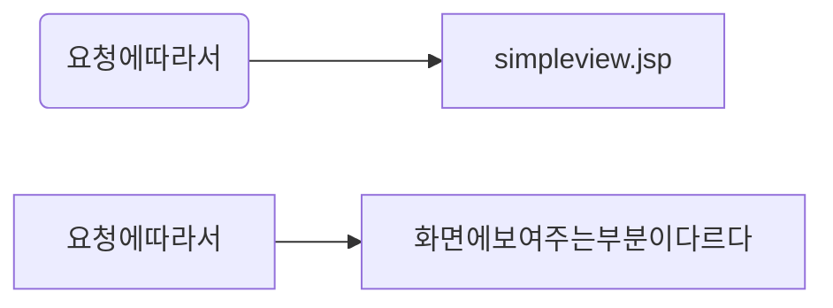

core
----

```
<%@tablib prefix="c" uri="http://java.sun.com/jsp/jstl/core" %>
```

#### jstl 의 forEach

-	형식

```
<c:forEach var="초기변수명" begin="시작값" end="종료값" step="증가치">
    출력문 ${}  <c:out value="${출력변수}" />
</c:forEach>
```

```java
<%@taglib prefix="c" uri="http://java.sun.com/jsp/jstl/core" %>

<c:forEach var="i" begin="1" end="100" step="2">
<c:set var="sum" value="${sum+i}"/>
</c:forEach>
```

---

```html
<%
     java.util.HashMap mapData=new java.util.HashMap();
     mapData.put("name","홍길동");
     mapData.put("today",new java.util.Date());
     //int [] intArray={1,2,3,4,5};
%>

<c:set var="map"  value="<%=mapData %>" />

<c:forEach var="i" items="${intArray}" begin="2" end="4">
    [${i}]
</c:forEach>

```

```
int형 배열

[3] [4] [5]

```

---

```html
<c:set var="intArray" value="<%=new int[]{1,2,3,4,5} %>" />

<c:forEach var="i" items="${map}">
    ${i.key}=${i.value}<br>
</c:forEach>
```

```
Map

today=Mon Jul 24 10:40:37 KST 2017
name=홍길동
```

---

#### base

-	상대경로를 절대경로로 인식하게 해준다
-	http://blog.naver.com/kimshps/80194727421 참조
-	escapeXml="true" 인 경우 해당 사이트 소스를 보여준다
-	escapeXml="false" 인 경우 사이트를 보여준다

```java
<base href="<c:out value='${url}'/>">
    <c:out value="${u}" escapeXml="false" />
</base>
```

#### import

-	include 액션원소처럼<br>동일한 웹 어플리케이션뿐만 아니라 외부의 다른 자원을 읽어와 포함시킬 수 있도록 <br> 보여주는 것과 함께 **절대 경로**를 통한 **외부 서버의 페이지까지 현재페이지**에서 보여주는 태그 - GET방식 또는 <c:param>태그를 이용하여 파라미터를 전송할 수도 있다.

-	★★★★

```
***
 <c:import>태그=> <jsp:include page="~.jsp" flush="false" />
  와 유사한 기능을 가진 액션태그(실행 결과를 삽입)

escapeXml="true"->태그자체를 문자열로 인식->문자형태로 출력
escapeXml="false">=>본문내용 그대로(실행결과)
***

------------------------------------------------------------
<jsp:include>액션 태그는 현재 위치에 무조건 결과를 출력하는 반면,
<c:import>태그는 EL변수에 보관한 뒤 필요에 따라 알맞은 처리를 할 수 있다.

```

##### import 예제1

```html
<c:set var="url" value="http://www.daum.net" />
<c:import url="${url}" var="u" />
<!-- url속성->접속할 사이트주소 u->접속한 사이트의 정보(변수) -->
<c:out value="${url}" /> 가져옵니다. //값을 그냥 출력
<hr>
<base href="<c:out value="${url}" />">  ??????????base 왜 쓴거야? 지워도 결과는 똑같은데??????
   <c:out value="${u}" escapeXml="false" /> ???????????위 아래 2번
</base>

```

##### import 예제2

```html
<c:set var="url" value="chooseTag.jsp" />
<c:import url="${url}" var="u" >
  <c:param name="name" value="bk" />
</c:import>
<hr>
<c:out value="${u}" escapeXml="false" />

```

##### chooseTag.jsp

```html
<c:when test="${param.name =='bk'}"> ???

 name 파라미터값은 ${param.name} 입니다.<br>
</c:when>

<!------------------------------------------------>
<c:when test="${param.age > 18}"> ????????
  당신의 나이는 18세 이상이군요!
</c:when>
<c:otherwise> ?????????
  <li>당신은 'bk' 도 아니고 나이도 18세 이상도 아니다.</li>
</c:otherwise>
```

---

fmt
---

```
<%@tablib prefix="fmt" uri="http://java.sun.com/jsp/jstl/fmt" %>
```

#### formatNumber (number. currency, percent, pattern)

```html
number:<fmt:formatNumber value="9876543.210" type="number" />
currency:<fmt:formatNumber value="9876543.210" type="currency" currencySymbol="$" />
percent:<fmt:formatNumber type="percent">
9876543.210
</fmt:formatNumber>
<p>

pattern=".000" : <fmt:formatNumber value="9876543.210" pattern=".000" />
pattern="#,###.0#" : <fmt:formatNumber value="9876543.210" pattern="#,###.0#" />
```

#### formatDate(date, time, both)

```html
<jsp:useBean id="now" class="java.util.Date" />
<c:out value="${now}" /><br>

date: <fmt:formatDate value="${now}" type="date" /><br>
time: <fmt:formatDate value="${now}" type="time" /><br>
both: <fmt:formatDate value="${now}" type="both" /><br>
```

```
Mon Jul 24 11:46:40 KST 2017
date: 2017. 7. 24
time: 오전 11:46:40
both: 2017. 7. 24 오전 11:46:40
```

#### formatDate()

##### formatDate 예시1

```html
<!--dateStyle(날짜만 세부적),timeStyle(시간을 세부적)  -->
default:<fmt:formatDate value="${now}" type="both"
              dateStyle="default" timeStyle="default" /><br>

short:<fmt:formatDate value="${now}" type="both"
              dateStyle="short" timeStyle="short" /><br>

medium:<fmt:formatDate value="${now}" type="both"
              dateStyle="medium" timeStyle="medium" /><br>   

long:<fmt:formatDate value="${now}" type="both"
              dateStyle="long" timeStyle="long" /><br>

full:<fmt:formatDate value="${now}" type="both"
              dateStyle="full" timeStyle="full" /><br>

pattern:"yyyy년 MM월 dd일 HH시 mm분 ss초":
      <fmt:formatDate value="${now}" type="both"
              pattern="yyyy년 MM월 dd일 HH시 mm분 ss" /><br>
```

```
default:2017. 7. 24 오전 11:51:27
short:17. 7. 24 오전 11:51
medium:2017. 7. 24 오전 11:51:27
long:2017년 7월 24일 (월) 오전 11시 51분 27초
full:2017년 7월 24일 월요일 오전 11시 51분 27초 KST
pattern:"yyyy년 MM월 dd일 HH시 mm분 ss초": 2017년 07월 24일 11시 51분 27초
```

##### formatDate 예시2

```html
<fmt:timeZone value="US/Eastern">
<fmt:formatDate value="${now}" type="both"
              pattern="yyyy년 MM월 dd일 HH시 mm분 ss" /><br>
</fmt:timeZone>  
```

```
2017년 07월 23일 22시 53분 28
```

---

#### 객체 생성하는 액션태그 2가지 ★★★★

```
1. <jsp:useBean id="now" class="java.util.Date" />
   <c:out value="${now}"/>

2. <c:set var="now" value="<%=new java.util.Date()%>">
```

---

---

MVC 구조
--------

(모델2) ==> 스프링(MVC) 구조로 되어있다.

-	**M : Model(모델)** -> 데이터가 저장되는 부분 즉, 빈즈부분 <br> 데이터를 저장하거나 데이터베이스로 데이터를 보내는 작업과 관련된 객체

-	**V: View(화면출력)** html, css, js, jsp파일 + 자바코드<%~%> <br>

-	**C: Control**

---

-	모델2-> 무조건 el, jstl을 사용한다는 것을 의미하지않고 **화면의 편리성**을 추구하는 것

---

##### 모델1 ★★★

-	요청(jsp, html) 버튼,링크문자열 클릭<br>--> list.jsp(자바코드+화면출력html, css)

-	장점 : <br> 1. 중소규모의 사이트 작성에 적함 <br> 2. 적은 인원으로도 구성이 가능(4~5)

-	단점 : <br> 1. jsp=>자바소스코드+화면출력(html) 혼영으로 인해 유지보수가 어려워진다. <br> 2. 페이지별로 중복된 코드가 많아진다

##### 모델2 ★★★

```
- M -> 데이터 저장부분
- V -> 처리결과를 받아서 출력만 담당
       1) 요청을 받는 부분-> Controller에게 전담
       2) 뷰에서 존재하는 자바코드 -> 요청명령어 클래스에서 처리

- C -> 요청을 받아서 그 요청에 맞는 요청명령어 클래스를 선택하여 처리
      빈즈메서드 호출(getArticles()) -> DB접속
```

-	장점 : <br> 1. 대규모 사이트에 작성하는데 적합한 구조(대기업) <br> 2. 역할 분담이 나누어져 있어서 유지보수가 쉽다.

-	단점 : <br> 1. 개개인의 실력 항상을 요구하고 서블릿중심이다. <br> 2. 구성원이 10인 이상을 요구

---

#### ServletTest2

-	요청 -> 서블릿이 요청을 받아서 그 요청에 해당하는 jsp로 페이지이동



##### SimpleController.java

```java

String type = request.getParameter("type");

Object resultObject = null;
if( type == null || type.equals("greeting")) {
  resultObject = "안녕하세요";
} else if (type.equals("date")){
  resltObject = new java.util.Date();
} else {
  resultObject = "Invalid Type";
}

//3. 처리결과 -> simpleview.jsp로 전송 -> 화면에 전송
//그냥 전송하면 끊어지므로 공유하기 위해서
request.setAttribute("result", resultObject); //데이터를 공유하는 것으로 forward방식으로 해야한다

//4.forward 액션태그를 사용할 수 없다. why?  java파일이므로
// 때문에 forward 시켜주는 객체가 필요하다
//getRequestDispatcher()가 실행되는 순간 지정된 페이지를 읽어들여서 리다이렉트 시킨다. 서버단에서 모든 작업이 이루어진다

RequestDispatcher dispatcher =
 request.getRequestDispatcher("/simpleview.jsp?result="+resultObject);

//5. forward -> 데이터를 공유시키면서 페이지 이동
dispatcher.forward(request, response);
```

---

#### 1. 요청명령어?->게시판의 글목록보기

```

요청명령어?->게시판의 글목록보기
                   글쓰기,상세보기,글수정,글삭제
                   글검색=>6개-->처리해주는 클래스도 6개->객체->메서드 필요

->~.do(스프링)
~.mov
~.nhn
======================================
```

```
1.요청명령어->컨트롤러에 요청명령어를 구분소스 계속 작성...

                       if(글목록을 요청) {
            글목록에 해당클래스 생성->메서드호출
        }else if(글쓰기) {
            글쓰기에 해당클래스 생성->메서드호출
        }else {
            resultObject="Invalid Type";
        }
                          ,,,,
```

#### 2. 컨트롤러 하나 작성하면 소스 계속 작성안해도된다.

-	**인터페이스**를 이용하여 동일한 소스 그대로 사용하는 방법

```
JspBoard2
     |
      -src
     |
      -WebContent->list.jsp~(el,jstl로 모두 변경)
               |
                -WEB-INF
                       |
                        -lib->standard.jar,jstl.jar복사(1)
```
